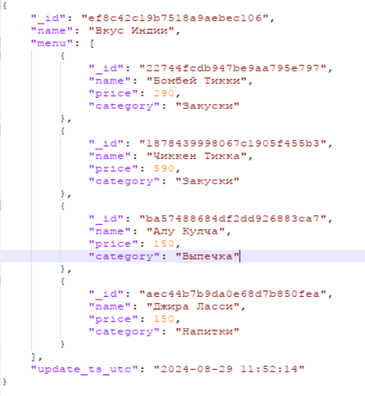

# Проект по облачным технологиям

## Задача
Разработать DWH в облаке для тегирования пользователей в приложении на основе статистики по заказам.  
Нужно реализовать сервисы, которые заполняют слои STG, DDS и CDM.  

## Описание слоёв 

STG — исходные данные as is.  
DDS — модель данных Data Vault.  
CDM — две витрины. Первая витрина — счётчик заказов по блюдам; вторая — счётчик заказов по категориям товаров.  
  
В качестве БД используется PostgreSQL

## Входные данные  

Первый канал — это поток заказов в формате JSON, который идёт в Kafka. 
Пример входного сообщения:  
  

Второй канал — это словарные данные в формате JSON (блюда, рестораны, пользователи), которые идут в Redis. Пример сообщения:  
  

## Архитектура решения выглядит так:    
  

  
## Используемые технологии  
Python, PostgreSQL, Kafka, Redis, Yandex Cloud,  Kubernetes

Cсылки на реджистри:  
cr.yandex/crp3u9gbpqgf4luk0aar/stg_service:v2024-09-17-r1  
cr.yandex/crp3u9gbpqgf4luk0aar/dds_service:v2024-09-17-r1  
cr.yandex/crp3u9gbpqgf4luk0aar/cdm_service:v2024-09-17-r1  

